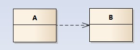

# 设计模式
> 设计模式(Design Pattern)是一套被反复使用、多数人知晓的、经过分类的、代码设计经验的总结。   
使用设计模式的目的：为了代码可重用性、让代码更容易被他人理解、保证代码可靠性。 设计模式使代码编写真正工程化。

## 类之间的关系

类的继承结构表现在UML中为：泛化(generalize)与实现(realize)：  
继承关系为 is-a的关系；两个对象之间如果可以用 is-a 来表示，就是继承关系：（..是..）
- 泛化关系用一条带空心箭头的实线表示，箭头指向父类；如下图：  
  
举例：SUV(A)是汽车(B)。  
泛化关系表现为继承非抽象类。

- 实现关系用一条带空心箭头的虚线表示，箭头指向接口或抽象类；如下图：  
  
举例：汽车(A)是车(B)。
实现关系表现为继承抽象类。
> 抽象类和接口的区别  
> - 从形态上看
> 1. 抽象类可以给出一些成员的实现，接口却不包含成员的实现；
> 2. 抽象类的抽象成员可被子类部分实现，接口的成员需要实现类完全实现，一个类只能继承一个抽象类，但可实现多个接口等等。  
> - 如何区分
> 1. 类是对对象的抽象，抽象类是对类的抽象；接口是对行为的抽象。
> 2. 若行为跨越不同类的对象，可使用接口；对于一些相似的类对象，用继承抽象类。
> 3. 抽象类是从子类中发现了公共的东西，泛化出父类，然后子类继承父类；接口是根本不知子类的存在，方法如何实现还不确认，预先定义。


- 聚合关系(aggregation)用一条带空心菱形箭头的实线表示，菱形指向整体，如下图:  
  
举例：公司(B)由员工(A)组成。  
聚合关系的整体和部分不是强依赖。即使整体不存在了，部分依然存在。

- 组合关系(composition)用一条带实心菱形箭头的实线表示，菱形指向整体，如下图:  
  
举例：公司(B)由部门(A)组成。  
聚合关系的整体和部分是强依赖。如果整体不存在了，部分也不存在了。

- 关联关系(association)描述不同类的对象之间的结构关系；它是一种静态关系， 通常与运行状态无关，一般由常识等因素决定的；它一般用来定义对象之间静态的、天然的结构； 所以，关联关系是一种“强关联”的关系。用一条直线表示，默认不强调方向，表示对象间相互知道；如果特别强调方向，如下图，表示A知道B，但B不知道A。如下图:  
  
举例：乘车人和车票的关联。  
在最终代码中，关联对象通常是以成员变量的形式实现，一般以类属性表示这两个类存在关联关系。
关联关系又可以进一步分为单向关联、双向关联和自关联。
    1. 单向关联：即一个类持有另一个类的实例作为属性。在UML类图中单向关联用一个带箭头的直线表示：
      
    2. 双向关联：即类双方各自持有对方类型的成员变量。在UML类图中，双向关联用一个不带箭头的直线表示：
      
    3. 自关联:即一个类持有自身类型的另一个实例作为属性。自关联在UML类图中用一个带有箭头且指向自身的直线表示：
      

- 依赖关系(dependency)描述一个对象在运行期间会用到另一个对象的关系。与关联关系不同的是，它是一种临时性的关系，通常在运行期间产生，并且随着运行时的变化，依赖关系也可能发生变化。依赖也有方向，双向依赖是一种非常糟糕的结构，我们总是应该保持单向依赖，杜绝双向依赖的产生。依赖关系是用一套带箭头的虚线表示的，箭头指向被依赖的一方；如下图表示A依赖于B:  
  
在最终代码中，依赖关系体现为类构造方法及类方法的传入参数，箭头的指向为调用关系。依赖关系除了临时知道对方外，还是“使用”对方的方法和属性。假设类A的变化引起了类B的变化，则说名类B依赖于类A。

##  设计模式的六大原则
1. 开闭原则(Open Close Principle)

开闭原则的意思是：对扩展开放，对修改关闭。在程序需要进行拓展的时候，不能去修改原有的代码，实现一个热插拔的效果。简言之，是为了使程序的扩展性好，易于维护和升级。想要达到这样的效果，我们需要使用接口和抽象类。

2. 里氏代换原则(Liskov Substitution Principle)

里氏代换原则是面向对象设计的基本原则之一。 里氏代换原则中说，任何基类可以出现的地方，子类一定可以出现。LSP 是继承复用的基石，只有当派生类可以替换掉基类，且软件单位的功能不受到影响时，基类才能真正被复用，而派生类也能够在基类的基础上增加新的行为。里氏代换原则是对开闭原则的补充。实现开闭原则的关键步骤就是抽象化，而基类与子类的继承关系就是抽象化的具体实现，所以里氏代换原则是对实现抽象化的具体步骤的规范。

3. 依赖倒转原则(Dependence Inversion Principle)

这个原则是开闭原则的基础，具体内容：针对接口编程，依赖于抽象而不依赖于具体。

4. 接口隔离原则(Interface Segregation Principle)

这个原则的意思是：使用多个隔离的接口，比使用单个接口要好。它还有另外一个意思是：降低类之间的耦合度。由此可见，其实设计模式就是从大型软件架构出发、便于升级和维护的软件设计思想，它强调降低依赖，降低耦合。

5. 迪米特法则，又称最少知道原则(Demeter Principle)

最少知道原则是指：一个实体应当尽量少地与其他实体之间发生相互作用，使得系统功能模块相对独立。

6. 合成复用原则(Composite Reuse Principle)

合成复用原则是指：尽量使用合成/聚合的方式，而不是使用继承。

## 设计模式的类型
### 创建型模式(Creational Patterns)
创建型模式提供了一种在创建对象的同时隐藏创建逻辑的方式，而不是使用 new 运算符直接实例化对象。这使得程序在判断针对某个给定实例需要创建哪些对象时更加灵活。
  - [单例模式(Singleton Pattern)](./doc/Creational/SingletonPattern.md)
  - [抽象工厂模式(Abstract Factory Pattern)](./doc/Creational/AbstractFactoryPattern.md)
  - [工厂模式(Factory Pattern)](./doc/Creational/FactoryPattern.md)
  - [建造者模式(Builder Pattern)](./doc/Creational/BuilderPattern.md)
  - [原型模式(Prototype Pattern)](./doc/Creational/PrototypePattern.md)

### 结构型模式(Structural Patterns)
结构型模式关注类和对象的组合。继承的概念被用来组合接口和定义组合对象获得新功能的方式。
  - [适配器模式(Adapter Pattern)](./doc/Structural/AdapterPattern.md)
  - [桥接模式(Bridge Pattern)](./doc/Structural/BridgePattern.md)
  - [组合模式(Composite Pattern)](./doc/Structural/CompositePattern.md)
  - [装饰器模式(Decorator Pattern)](./doc/Structural/DecoratorPattern.md)
  - [外观模式(Facade Pattern)](./doc/Structural/FacadePattern.md)
  - [享元模式(Flyweight Pattern)](./doc/Structural/FlyweightPattern.md)
  - [代理模式(Proxy Pattern)](./doc/Structural/ProxyPattern.md)

### 行为型模式(Behavioral Patterns)
行为型模式特别关注对象之间的通信。
  - [职责链模式(Chain of Responsibility Pattern)](./doc/Behavioral/ChainofResponsibilityPattern.md)
  - [命令模式(Command Pattern)](./doc/Behavioral/CommandPattern.md)
  - [解释器模式(Interpreter Pattern)](./doc/Behavioral/InterpreterPattern.md)
  - [迭代器模式(Iterator Pattern)](./doc/Behavioral/IteratorPattern.md)
  - [中介者模式(Mediator Pattern)](./doc/Behavioral/MediatorPattern.md)
  - [备忘录模式(Memento Pattern)](./doc/Behavioral/MementoPattern.md)
  - [观察者模式(Observer Pattern)](./doc/Behavioral/ObserverPattern.md)
  - [状态模式(State Pattern)](./doc/Behavioral/StatePattern.md)
  - [策略模式(Strategy Pattern)](./doc/Behavioral/StrategyPattern.md)
  - [模板模式(Template Pattern)](./doc/Behavioral/TemplatePattern.md)
  - [访问者模式(Visitor Pattern)](./doc/Behavioral/VisitorPattern.md)

---
文档参考了[图说设计模式](https://design-patterns.readthedocs.io/zh_CN/latest/index.html)和《JavaScript设计模式及开发实践》。

代码使用Typescript语言编写，编译过程：

```
cd Design-pattern/code
tsc --init
```

如果编译某一个设计模式可以采用如下命令： 

```
cd Design-pattern/code/singleton
tsc --target ES5 --module system --outFile singleton.js singleton.ts
```

