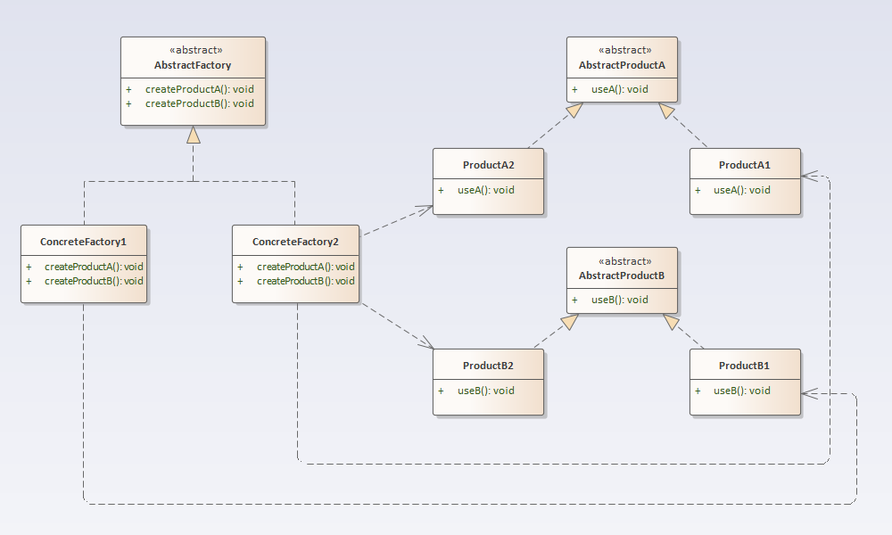

## 抽象工厂模式

### 定义
抽象工厂模式： 提供一个创建一系列相关或相互依赖对象的接口，而无须指定它们具体的类。
### 结构分析
抽象工厂模式包含如下角色：
- AbstractFactory：抽象工厂
- ConcreteFactory：具体工厂
- AbstractProduct：抽象产品
- Product：具体产品
  
### [代码实现](../code/abstractFactory)
### 优点
- 抽象工厂模式可以实现高内聚低耦合的设计目的。
- 当一个产品族中的多个对象被设计成一起工作时，它能够保证客户端始终只使用同一个产品族中的对象。
- 增加新的具体工厂和产品族很方便，无须修改已有系统，符合“开闭原则”。
### 缺点
在添加新的产品对象时，难以扩展抽象工厂来生产新种类的产品，这是因为在抽象工厂角色中规定了所有可能被创建的产品集合，要支持新种类的产品就意味着要对该接口进行扩展，而这将涉及到对抽象工厂角色及其所有子类的修改，显然会带来较大的不便。
### 使用场景
很多软件系统中需要更换界面主题，要求界面中的按钮、文本框、背景色等一起发生改变时，可以使用抽象工厂模式进行设计。