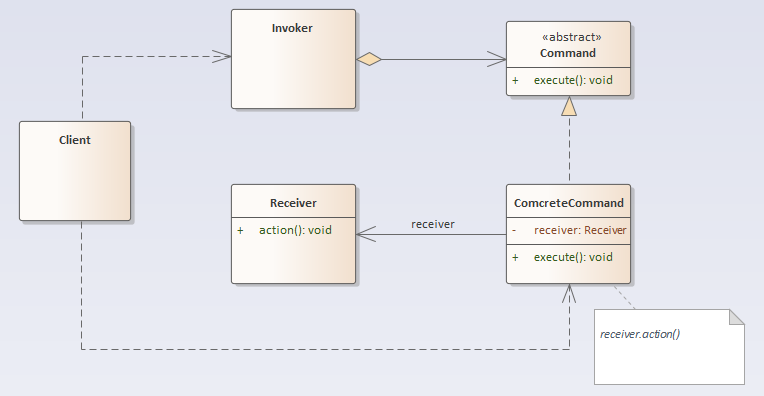

## 命令模式

### 定义
命令模式：将一个请求封装为一个对象，从而使我们可用不同的请求对客户进行参数化；对请求排队或者记录请求日志，以及支持可撤销的操作。

### 结构分析
命令模式包含如下角色：
- 抽象命令类（Command）：定义需要执行的所有命令行为。
- 具体命令类（ConcreteCommand）：实现在抽象命令类中声明的方法，它对应具体的接收者对象，将接收者对象的动作绑定其中。
- 调用者（Invoker）：接收客户端的命令，并执行命令。
- 接收者（Receiver）：负责具体实施或执行一个请求。

  

### [代码实现](../../code/command)

### 优点
- 降低系统的耦合度。
- 新的命令可以很容易地加入到系统中。
- 可以比较容易地设计一个命令队列和宏命令（组合命令）。
- 可以方便的实现对请求的撤销和恢复。

### 缺点
- 使用命令模式可能会导致某些系统有过多的具体命令类。因为针对每一个命令都需要设计一个具体命令类，因此某些系统可能需要大量具体命令类，这将影响命令模式的使用。

### 使用场景
- 系统需要将请求调用者和请求接收者解耦，使得调用者和接收者不直接交互。
- 系统需要在不同的时间指定请求、将请求排队和执行请求。
- 系统需要支持命令的撤销(Undo)操作和恢复(Redo)操作。
- 系统需要将一组操作组合在一起，即支持宏命令。

### 实例
- 遥控器可以对设备进行相关操作。
