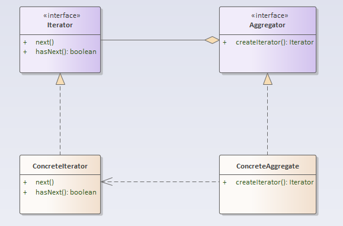

## 迭代器模式

### 定义
迭代器模式：提供一种顺序访问聚集/容器对象元素的方法，而又无须暴露聚集内部表象。

### 结构分析
迭代器模式主要包含以下角色：
- 抽象迭代器（Iterator）：抽象迭代器负责定义访问和遍历元素的接口。
- 具体迭代器（ConcreteIterator）：提供具体的元素遍历行为。
- 抽象容器（Aggregator）：负责定义提供具体迭代器的接口。
- 具体容器（ConcreteAggregate）：创建具体迭代器。

  

### [代码实现](../../code/iterator)

### 优点
- 多态迭代：为不同的聚合结构提供一致的遍历接口，即一个迭代接口可以访问不同的聚集对象。
- 简化聚集对象接口：迭代器模式将聚集对象本身应该提供的元素迭代接口抽取到了迭代器中，使聚集对象无须关心具体迭代行为。
- 元素迭代功能多样化：每个聚集对象都可以提供一个或多个不同的迭代器，使的同种元素聚合结构可以有不同的迭代行为。
- 解耦迭代与聚集：迭代器模式封装了具体的迭代算法，迭代算法的变化，不会影响到聚集对象的架构。

### 缺点
- 由于迭代器模式将存储数据和遍历数据的职责分离，增加新的聚合类需要对应增加新的迭代器类，类的个数成对增加，这在一定程度上增加了系统的复杂性。

### 使用场景
- 访问一个聚合对象的内容而无须暴露它的内部表示。
- 需要为聚合对象提供多种遍历方式。
- 为遍历不同的聚合结构提供一个统一的接口。

### 实例
- 提供一致的遍历行为。
