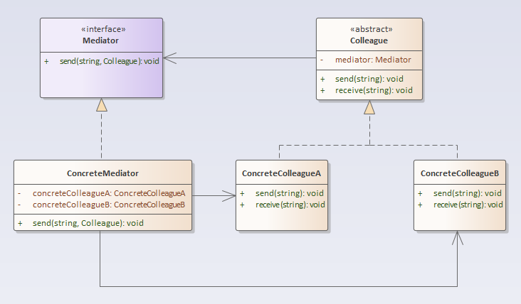

## 中介者模式

### 定义
中介者模式：用一个中介对象来封装一系列的对象交互，中介者使各对象不需要显式地相互引用，从而使其耦合松散，而且可以独立地改变它们之间的交互。

### 结构分析
中介者模式包含如下角色：
- Mediator: 抽象中介者
- ConcreteMediator: 具体中介者
- Colleague: 抽象同事类
- ConcreteColleague: 具体同事类

  

### [代码实现](../../code/mediator)

### 优点
- 简化了对象之间的交互。
- 将各同事解耦。
- 减少子类生成。
- 可以简化各同事类的设计和实现。

### 缺点
- 在具体中介者类中包含了同事之间的交互细节，可能会导致具体中介者类非常复杂，使得系统难以维护。

### 使用场景
- 系统中对象之间存在复杂的引用关系，产生的相互依赖关系结构混乱且难以理解。
- 一个对象由于引用了其他很多对象并且直接和这些对象通信，导致难以复用该对象。
- 想通过一个中间类来封装多个类中的行为，而又不想生成太多的子类。可以通过引入中介者类来实现，在中介者中定义对象。
- 交互的公共行为，如果需要改变行为则可以增加新的中介者类。
