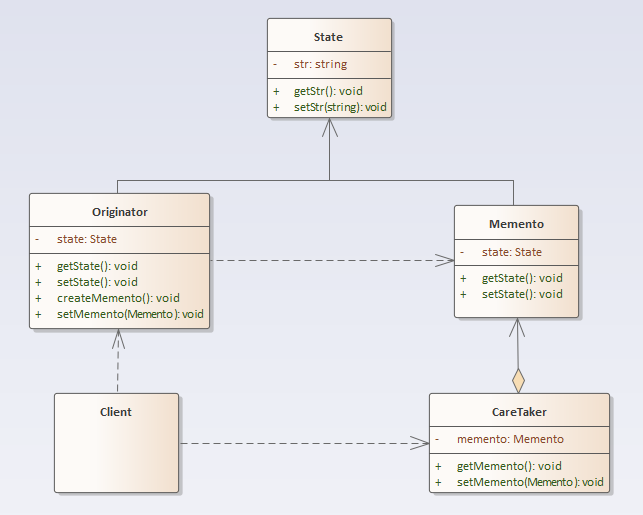

## 备忘录模式

### 定义
备忘录模式：在不破坏封装性的前提下，捕获一个对象的内部状态，并在该对象之外保存这个状态。这样以后就可将该对象恢复到原先保存的状态。

### 结构分析
备忘录模式包含如下角色：
- 发起人角色（Originator）：负责创建一个备忘录，记录自身需要保存的状态，具备状态回滚功能。
- 备忘录角色（Memento）：用于存储 Originator 的内部状态，且可以防止 Originator 以外的对象进行访问。
- 备忘录管理员角色（Caretaker）：负责存储，提供，管理备忘录，无法对备忘录内容进行操作和访问。

  

### [代码实现](../../code/memento)

### 优点
- 简化发起人实体类（Originator）职责，隔离状态存储与获取，实现了信息的封装，客户端无需关心状态的保存细节。
- 提供状态回滚功能。

### 缺点
- 消耗资源：如果需要保存的状态过多时，每一次保存都会消耗很多内存。

### 使用场景
- 需要保存历史快照的场景。
- 希望在对象之外保存状态，且除了自己其他类对象无法访问状态保存具体内容。

### 实例
- 某游戏规定，对于之前任意通关的关卡，可以随时跳回并继续游戏。
