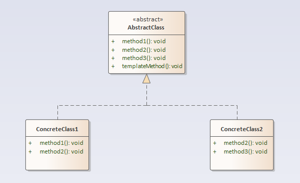

## 模板方法模式

### 定义
模板方法模式：定义一个操作中的算法的框架，而将一些步骤延迟到子类中。使得子类可以不改变一个算法的结构即可重定义该算法的某些特定步骤。

### 结构分析
模板方法模式包含以下角色：
- 抽象模板（AbstractClass）：抽象模板类，定义了一套算法框架/流程。
- 具体实现（ConcreteClass）：具体实现类，对算法框架/流程的某些步骤进行了实现。

  

### [代码实现](../../code/template)

### 优点
- 封装不变，扩展可变：父类封装了具体流程以及实现部分不变行为，其它可变行为交由子类进行具体实现，更换和增加新的子类很方便，符合单一职责原则和开闭原则。
- 流程由父类控制，子类进行实现：框架流程由父类限定，子类无法更改；子类可以针对流程某些步骤进行具体实现。
- 可实现一种反向控制结构，通过子类覆盖父类的钩子方法来决定某一特定步骤是否需要执行。

### 缺点
- 每一个不同的实现都需要一个子类来实现，导致类的个数增加，使得系统更加庞大。

### 使用场景
- 有多个子类共有的方法，且逻辑相同。
- 重要的、复杂的方法，可以考虑作为模板方法。
- 重构时，模板方法模式 是一个经常使用的模式，把相同的代码抽取到父类，然后通过钩子函数约束其行为。

### 实例
炒两道菜：炒豆芽和炒茄子：炒菜都有固定步骤：洗菜，热锅下油，下菜翻炒，下调料，起锅。由于炒菜流程是固定的，而其中有些步骤对不同的菜而言具备不同的操作，因此可以使用模板方法模式完成炒菜过程。
