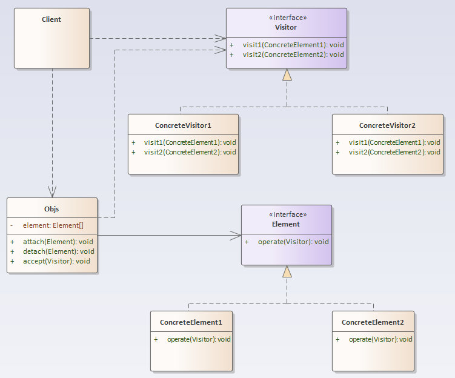

## 访问者模式

### 定义
访问者模式：封装一些作用于某种数据结构中的各元素的操作，它可以在不改变数据结构的前提下定义作用于这些元素的新的操作。
### 结构分析
访问者模式主要包含以下角色：
- 抽象访问者（Visitor）：接口或抽象类，该类地冠以了对每一个具体元素（Element）的访问行为visit，其参数就是具体的元素（Element）对象。理论上来说，Visitor 的方法个数与元素（Element）个数是相等的。如果元素（Element）个数经常变动，会导致 Visitor 的方法也要进行变动，此时，该情形并不适用 访问者模式；
- 具体访问者（ConcreteVisitor）：实现对具体元素的操作；
- 抽象元素（Element）：接口或抽象类，定义了一个接受访问者访问的方法accept，表示所有元素类型都支持被访问者访问；
- 具体元素（Concrete Element）：具体元素类型，提供接受访问者的具体实现。通常的实现都为：visitor.visit(this)；
- 结构对象（ObjectStruture）：该类内部维护了元素集合，并提供方法接受访问者对该集合所有元素进行操作。

  

### [代码实现](../../code/visitor)

### 优点
- 解耦了数据结构与数据操作，使得操作集合可以独立变化；
- 扩展性好：可以通过扩展访问者角色，实现对数据集的不同操作；
- 元素类型无需一致，访问者均可操作；
- 各角色职责分离，符合单一职责原则；

### 缺点
- 无法增加元素类型：若系统数据结构对象易于变化，经常有新的数据对象增加进来，则访问者类必须增加对应元素类型的操作，违背了开闭原则；
- 具体元素变更困难：具体元素增加属性，删除属性等操作会导致对应的访问者类需要进行相应的修改，尤其当有大量访问者类时，修改范围太大；
- 违背依赖倒置原则：为了达到”区别对待“，访问者依赖的是具体元素类型，而不是抽象；

### 使用场景
- 数据结构稳定，作用于数据结构的操作经常变化的场景；
- 需要数据结构与数据操作分离的场景；
- 需要对不同数据类型（元素）进行操作，而不使用分支判断具体类型的场景；