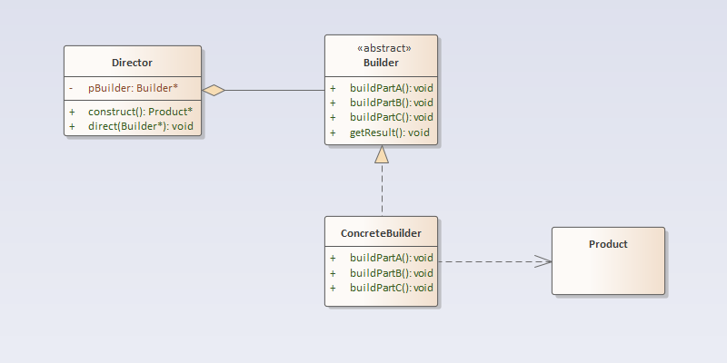

## 建造者模式
### 定义
造者模式：将一个复杂对象的构建与它的表示分离，使得同样的构建过程可以创建不同的表示。
### 结构分析
建造者模式包含如下角色：
- Builder：抽象建造者
- ConcreteBuilder：具体建造者
- Director：指挥者
- Product：产品角色
  
### [代码实现](../code/builder)
### 优点
### 缺点
### 使用场景