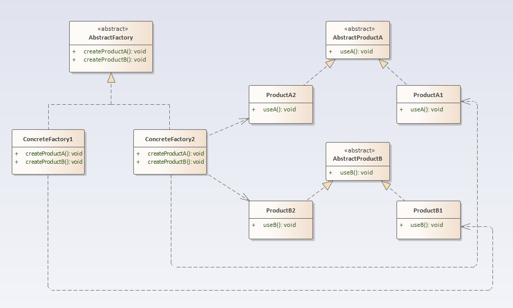

## 抽象工厂模式

### 定义
抽象工厂模式： 提供一个创建一系列相关或相互依赖对象的接口，而无须指定它们具体的类。

### 结构分析
抽象工厂模式包含如下角色：
- 抽象工厂（AbstractFactory）
- 具体工厂（ConcreteFactory）
- 抽象产品（AbstractProduct）
- 具体产品（Product）

  

### [代码实现](../../code/abstractFactory)

### 优点
- 抽象工厂模式可以实现高内聚低耦合的设计目的。
- 当一个产品族中的多个对象被设计成一起工作时，它能够保证客户端始终只使用同一个产品族中的对象。
- 增加新的具体工厂和产品族很方便，无须修改已有系统，符合“开闭原则”。

### 缺点
- 在添加新的产品对象时，难以扩展抽象工厂来生产新种类的产品，这是因为在抽象工厂角色中规定了所有可能被创建的产品集合，要支持新种类的产品就意味着要对该接口进行扩展，而这将涉及到对抽象工厂角色及其所有子类的修改，显然会带来较大的不便。

### 使用场景
- 一个系统不应当依赖于产品类实例如何被创建、组合和表达的细节，这对于所有类型的工厂模式都是重要的。
- 系统中有多于一个的产品族，而每次只使用其中某一产品族。
- 属于同一个产品族的产品将在一起使用，这一约束必须在系统的设计中体现出来。
- 系统提供一个产品类的库，所有的产品以同样的接口出现，从而使客户端不依赖于具体实现。

### 实例
- 很多软件系统中需要更换界面主题，要求界面中的按钮、文本框、背景色等一起发生改变时，可以使用抽象工厂模式进行设计。
