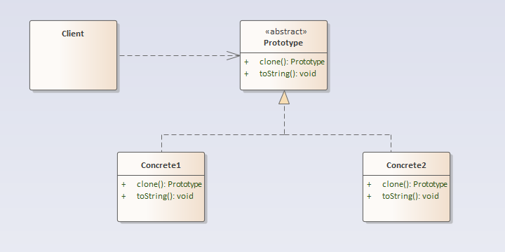

## 原型模式

### 定义
原型模式：使用原型实例指定创建对象的种类，并且通过拷贝原型对象创建新的对象。

### 结构分析
原型模式包含如下角色：
- 抽象原型角色（Prototype）：规定了具体原型对象必须实现的接口（如果要提供深拷贝，则必须具有实现clone的规定）。
- 具体原型（ConcretePrototype）：从抽象原型派生而来，是客户程序使用的对象，即被复制的对象，需要实现抽象原型角色所要求的接口。
- 客户角色（Client）：使用原型对象的客户程序。

  

### [代码实现](../../code/prototype)  

### 优点
- 运行时增加产品。因为可以在运行时动态根据原型生成新的种类的对象。
- 减少子类的构造，减少在系统中用到的类的数量。
- 用类动态配置应用。在运行时动态加载类。

### 缺点
- 原型模式的主要缺陷是每一个抽象原型Prototype的子类都必须实现clone操作，实现clone函数可能会很困难。但由于js天然支持prototype，因此原型的实现方式与其他类继承语言有些不同，不需要通过对象提供clone方法也可以来实现原型模式。

### 使用场景
- 当一个系统应该独立于它的产品创建、构成和表示时，要使用原型模式
- 当要实例化的类是在运行时刻指定时，如通过动态装载
- 为了避免创建一个与产品类层次平行的工厂类层次时
- 当一个类的实例只能有几个不同状态组合中的一种时。建立相应数目的原型并克隆原型可能比每次用合适的状态手工实例化原型类更方便一些。

### 实例
- 拷贝原型对象。