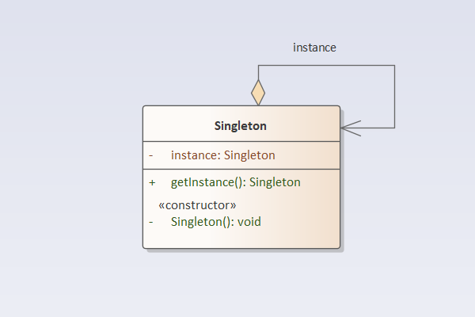

## 单例模式

### 定义
单例模式： 保证一个类仅有一个实例，而且自行实例化并向整个系统提供这个实例，这个类称为单例类，提供一个访问它的全局访问点。  
要点：
1. 某个类只能有一个实例。
2. 它必须自行创建这个实例。
3. 它必须自行向整个系统提供这个实例。

### 结构分析
单例模式的目的是保证一个类仅有一个实例，并提供一个访问它的全局访问点。单例模式包含的角色只有一个，就是单例类——Singleton。单例类拥有一个私有构造函数，确保用户无法通过new关键字直接实例化它。除此之外，该模式中包含一个静态私有成员变量与静态公有的工厂方法，该工厂方法负责检验实例的存在性并实例化自己，然后存储在静态成员变量中，以确保只有一个实例被创建。  
在单例模式的实现过程中，需要注意如下三点： 
1. 单例类的构造函数为私有。
2. 提供一个自身的静态私有成员变量。
3. 提供一个公有的静态工厂方法。  

  

### [代码实现](../../code/singleton)

### 优点
- 提供了对唯一实例的受控访问。
- 由于在系统内存中只存在一个对象，因此可以节约系统资源，对于一些需要频繁创建和销毁的对象，单例模式可以提高系统的性能。

### 缺点
- 单例类的职责过重，在一定程度上违背了“单一职责原则”。因为单例类既充当了工厂角色，提供了工厂方法，同时又充当了产品角色，包含一些业务方法，将产品的创建和产品的本身的功能融合到一起。
- 没有接口、不能继承。

### 使用场景
- 生成唯一序列号。
- 创建消耗资源较多的对象。如文件读写、连接数据库等。

### 实例
- 在操作系统中，打印池是一个用于管理打印任务的应用程序，通过打印池用户可以删除、中止或者改变打印任务的优先级，在一个系统中只允许运行一个打印池对象，如果重复创建打印池则抛出异常。