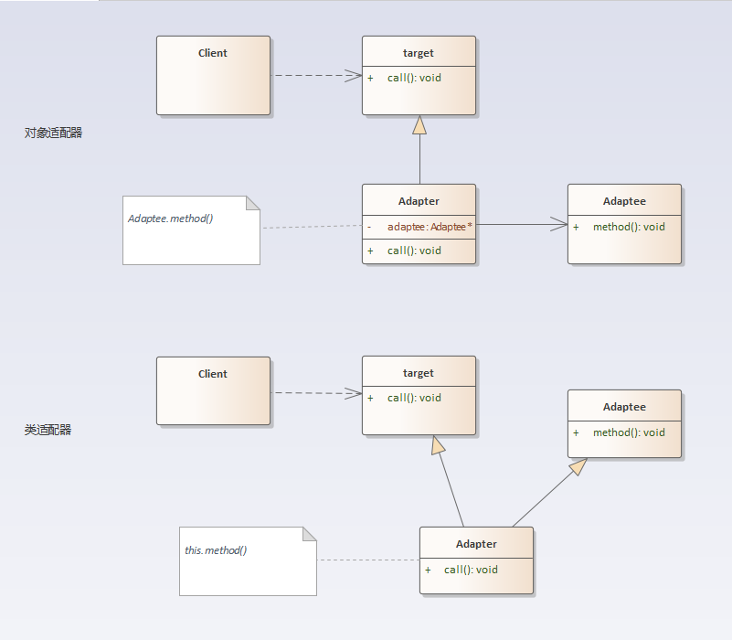

## 适配器模式

### 定义
适配器模式：将一个接口转换成客户希望的另一个接口，适配器模式使接口不兼容的那些类可以一起工作，其别名为包装器(Wrapper)。适配器模式既可以作为类结构型模式，也可以作为对象结构型模式。

### 结构分析
适配器模式包含如下角色：
- 目标抽象类（Target）：定义客户所需接口。
- 适配器类（Adapter）：适配器可以调用另一个接口，作为一个转换器，对Adaptee和Target进行适配，适配器类是适配器模式的核心，在对象适配器中，它通过继承Target并关联一个Adaptee对象使二者产生联系。
- 适配者类（Adaptee）：适配者即被适配的角色，它定义了一个已经存在的接口，这个接口需要适配，一般是一个具体类，包含了客户希望使用的业务方法，在某些情况下可能没有适配者类的源代码。

  

### [代码实现](../../code/adapter)

### 优点
- 将目标类和适配者类解耦，通过引入一个适配器类来重用现有的适配者类，而无须修改原有代码。
- 增加了类的透明性和复用性，将具体的实现封装在适配者类中，对于客户端类来说是透明的，而且提高了适配者的复用性。
- 灵活性和扩展性都非常好，通过使用配置文件，可以很方便地更换适配器，也可以在不修改原有代码的基础上增加新的适配器类，完全符合“开闭原则”。

#### 类适配器模式还具有如下优点：
由于适配器类是适配者类的子类，因此可以在适配器类中置换一些适配者的方法，使得适配器的灵活性更强。

#### 对象适配器模式还具有如下优点：
一个对象适配器可以把多个不同的适配者适配到同一个目标，也就是说，同一个适配器可以把适配者类和它的子类都适配到目标接口。

### 缺点
- 类适配器：单继承机制使得同时只能适配一个被适配类。
- 对象适配器：与类适配器模式相比，要想置换被适配类的方法就不容易。

### 使用场景
- 系统需要使用现有的类，而这些类的接口不符合系统的需要。
- 想要建立一个可以重复使用的类，用于与一些彼此之间没有太大关联的一些类，包括一些可能在将来引进的类一起工作。

### 实例
- 电源插座是220V的，但手机充电时只需要5V，因此我们需要一个适配器让手机能在220V插座上充电。
