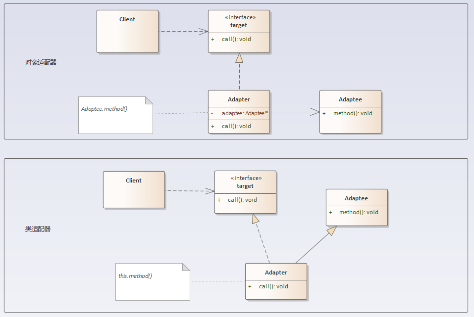

## 适配器模式

### 定义
适配器模式：将一个接口转换成客户希望的另一个接口，适配器模式使接口不兼容的那些类可以一起工作，其别名为包装器(Wrapper)。适配器模式既可以作为类结构型模式，也可以作为对象结构型模式。

### 结构分析
适配器模式包含如下角色：
- Target：目标抽象类
- Adapter：适配器类
- Adaptee：适配者类
- Client：客户类

  

### [代码实现](../../code/adapter)

### 优点
- 将目标类和适配者类解耦，通过引入一个适配器类来重用现有的适配者类，而无须修改原有代码。
- 增加了类的透明性和复用性，将具体的实现封装在适配者类中，对于客户端类来说是透明的，而且提高了适配者的复用性。
- 灵活性和扩展性都非常好，通过使用配置文件，可以很方便地更换适配器，也可以在不修改原有代码的基础上增加新的适配器类，完全符合“开闭原则”。
#### 类适配器模式还具有如下优点：
由于适配器类是适配者类的子类，因此可以在适配器类中置换一些适配者的方法，使得适配器的灵活性更强。
#### 对象适配器模式还具有如下优点：
一个对象适配器可以把多个不同的适配者适配到同一个目标，也就是说，同一个适配器可以把适配者类和它的子类都适配到目标接口。

### 缺点
- 类适配器：单继承机制使得同时只能适配一个被适配类；
- 对象适配器：与类适配器模式相比，要想置换被适配类的方法就不容易；

### 使用场景
- 系统需要使用现有的类，而这些类的接口不符合系统的需要。
- 想要建立一个可以重复使用的类，用于与一些彼此之间没有太大关联的一些类，包括一些可能在将来引进的类一起工作。