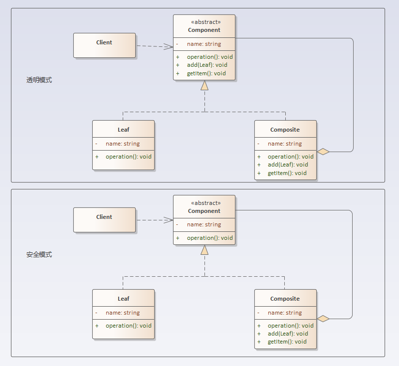

## 组合模式

### 定义
组合模式：通过将单个对象（叶子节点）和组合对象（树枝节点）用相同的接口进行表示，使得客户对单个对象和组合对象的使用具有一致性。

### 结构分析
组合模式包含如下角色：
- Component：抽象构件
- Leaf：叶子构件
- Composite：容器构件
#### 组合模式在代码具体实现上，有两种不同的方式：
1. 透明模式：把组合（树节点）使用的方法放到统一行为（Component）中，让不同层次（树节点，叶子节点）的结构都具备一致行为。
2. 安全模式：统一行为（Component）只规定系统各个层次的最基础的一致行为，而把组合（树节点）本身的方法（管理子类对象的添加，删除等）放到自身当中。

  

### [代码实现](../../code/composite)

### 优点
#### 透明组合模式的优点
- 客户端无需分辨是叶子节点（Leaf）和树枝节点（Composite），它们具备完全一致的接口。
#### 安全组合模式的优点
- 接口定义职责清晰，符合设计模式“单一职责原则”和“接口隔离原则”。
### 缺点
#### 透明组合模式的缺点
- 叶子节点（Leaf）会继承得到一些它所不需要（管理子类操作的方法）的方法，这与设计模式“接口隔离原则”相违背。
#### 安全组合模式的缺点
- 客户需要区分树枝节点（Composite）和叶子节点（Leaf），这样才能正确处理各个层次的操作，客户端无法依赖抽象（Component），违背了设计模式“依赖倒置原则”。

### 使用场景
果当系统绝大多数层次具备相同的公共行为时，采用透明组合模式也许会更好（代价：为剩下少数层次节点引入不需要的方法）；而如果当系统各个层次差异性行为较多或者树节点层次相对稳定（健壮）时，采用安全组合模式。
