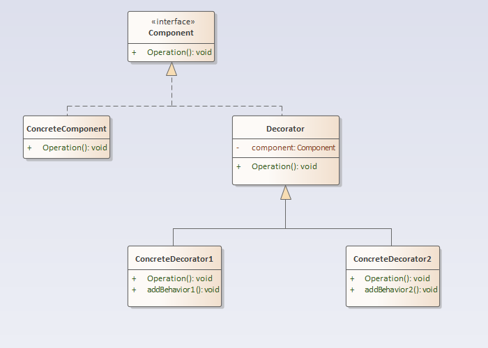

## 装饰模式

### 定义
装饰模式：动态地给一个对象增加一些额外的职责，就增加对象功能来说，装饰模式比生成子类实现更为灵活。

### 结构分析
装饰模式包含如下角色：
- 抽象组件（Component）：是一个接口或者抽象类，其充当被装饰类的原始对象，声明了在具体构件中实现的业务方法。
- 具体组件（ConcreteComponent）：定义具体的构件对象，实现了在抽象构件中声明的方法，装饰器可以给它增加额外的职责。
- 抽象装饰器（Decorator）：用于给具体构件增加职责，但是具体职责在其子类中实现。它维护一个指向抽象构件对象的引用，通过该引用可以调用装饰之前构件对象的方法，并通过其子类扩展该方法，以达到装饰的目的。
- 具体装饰器（ConcreteDecorator）：Decorator的具体实现类，每一个具体装饰类都定义了一些新的行为，它可以调用在抽象装饰类中定义的方法，并可以增加新的方法用以扩充对象的行为。

  

### [代码实现](../../code/decorator)

### 优点
- 装饰模式与继承关系的目的都是要扩展对象的功能，但是装饰模式可以提供比继承更多的灵活性。
- 可以通过一种动态的方式来扩展一个对象的功能，通过配置文件可以在运行时选择不同的装饰器，从而实现不同的行为。
- 通过使用不同的具体装饰类以及这些装饰类的排列组合，可以创造出很多不同行为的组合。可以使用多个具体装饰类来装饰同一对象，得到功能更为强大的对象。
- 具体构件类与具体装饰类可以独立变化，用户可以根据需要增加新的具体构件类和具体装饰类，在使用时再对其进行组合，原有代码无须改变，符合“开闭原则”。

### 缺点
- 使用装饰模式进行系统设计时将产生很多小对象，这些对象的区别在于它们之间相互连接的方式有所不同，而不是它们的类或者属性值有所不同，同时还将产生很多具体装饰类。这些装饰类和小对象的产生将增加系统的复杂度，加大学习与理解的难度。
- 这种比继承更加灵活机动的特性，也同时意味着装饰模式比继承更加易于出错，排错也很困难，对于多次装饰的对象，调试时寻找错误可能需要逐级排查，较为烦琐。

### 使用场景
- 需要扩展一个类的功能，或给一个类增加附加功能。
- 需要动态地给一个对象增加功能，且这些功能可以再动态地撤销。
- 需要为一批的兄弟类进行改装或加装功能。

### 实例
- 给可视化组件添加边框、滚动条等。
