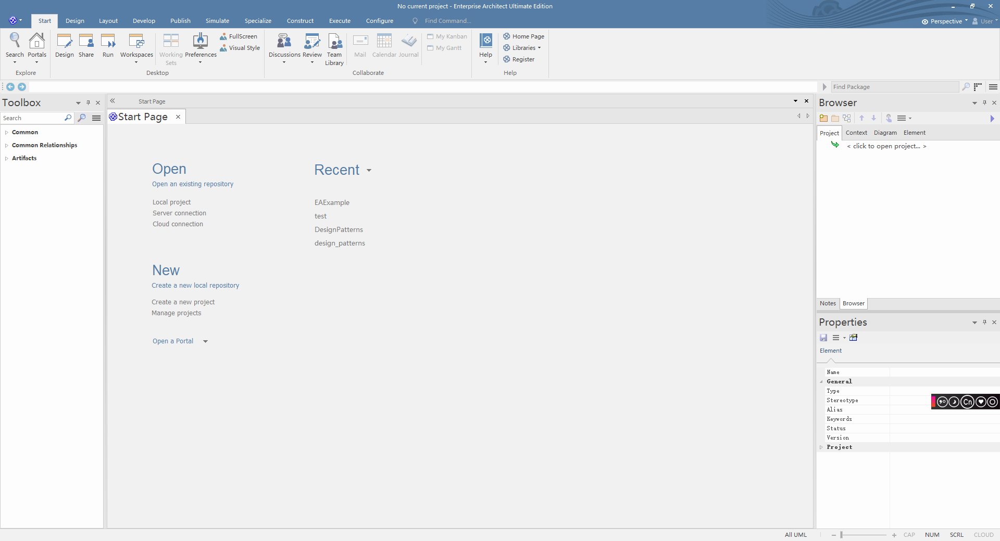
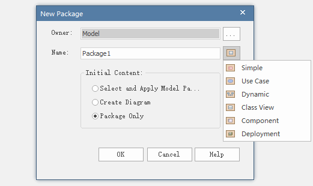
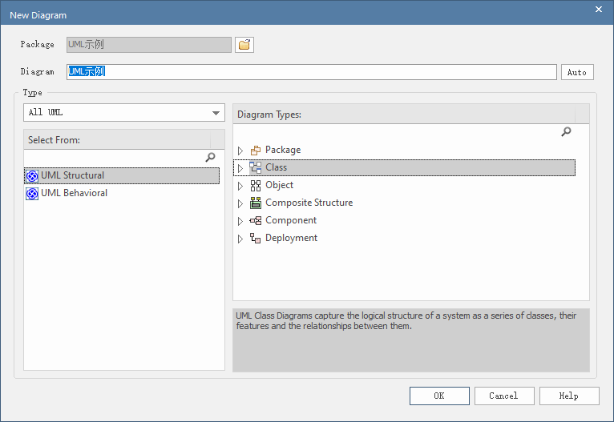
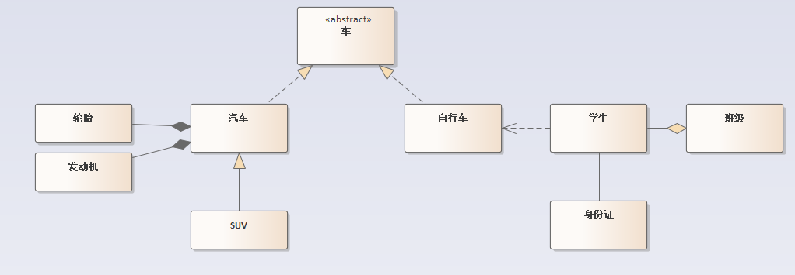

## UML类图

文档中所有类图均在DesignPattern.eapx中，类图使用Enterprise Architect 15绘制。

### 使用EA15绘制UML类图
1. 安装EA15软件。安装后软件如图（由于个人习惯调整了位置导致选项卡相比默认位置有所不同）：  
  

2. 点击左上角图标->New Project...生成新项目并保存。

3. 右击Browser选项卡下的Model->Add View...添加视图（或点击工具栏第二个图标），选择包的属性，这里我选择了Component、Package Only。  
      

4. 根据需求在创建的视图下添加图表或子视图。视图右击 Add a Diagram...添加图表，选择图表类型，绘制UML类图选择UML Structural下的class。  
      

5. 创建图表后会显示对应图表的ToolBox，可以根据需求生成类和类的关系。  

Tips: 

  1. 生成Class后双击，在Stereotype可以设置class的类型。如抽象类、接口；
  2. 右击Class模块->Features->Attributes可以打开Features工具给class添加变量、方法；
  3. 生成类之间的关系后，右击关系连线-> Line Style 可以设置连线样式。

示例： 
  